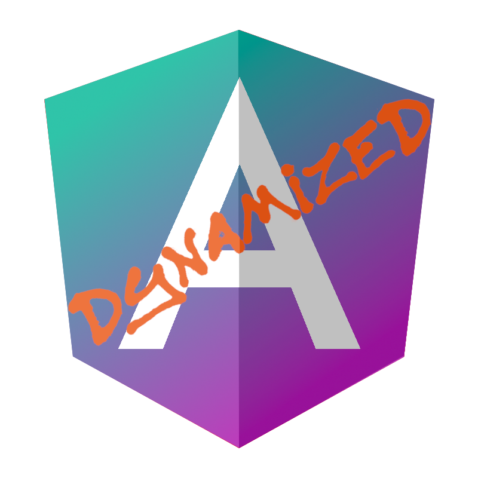

[](https://omnidyon.com/project-demo/ngx-snippets)
[](https://www.npmjs.com/package/@omnidyon/ngx-snippets)
[](https://www.npmjs.com/package/@omnidyon/ngx-snippets)
[](https://opensource.org/licenses/MIT)
[](https://github.com/omnidyon/ngx-snippets)

<h1 align="center">Ngx Snippets</h1>

<a name="start"></a>

<p align="center">
  
  <br>
  <em>Ngx Snippets is an Angular library used to present code snippets in your Angular applications.</em>
  <br>
</p>

<p align="center">
  <a href="CONTRIBUTING.md">Contributing Guidelines</a>
  ·
  <a href="https://github.com/omnidyon/ngx-snippets/issues">Submit an Issue</a>
    ·
  <a href="./projects/ngx-snippets/README.md">Documentation</a>
</p>

**Live Demo**  
[Check out the full interactive playground](https://omnidyon.com/tools/ngx-snippets)  
_(Includes copy/paste functionality, custom styling, and theme creation preview.)_

Found this useful? [Star the repo](https://github.com/omnidyon/ngx-snippets)  
Need help integrating? [Book a consult](https://omnidyon.com/book)

## Documentation

### Full library documentation

If you need help on using Ngx Snippets please refer to the provided <a href="./projects/ngx-snippets/README.md">documentation</a>.

## Contributing

### Contributing Guidelines

Read through our [contributing guidelines][contributing] to learn about our submission process, coding rules, and more.

### Code of Conduct

Please read and follow our [Code of Conduct][codeofconduct].

## Development

### Development Setup

1. Fork the repo - see full <a href="https://docs.github.com/en/pull-requests/collaborating-with-pull-requests/working-with-forks/fork-a-repo">guide</a>.

2. Clone the repo - see full <a href="https://docs.github.com/en/pull-requests/collaborating-with-pull-requests/working-with-forks/fork-a-repo#cloning-your-forked-repository">guide</a>.

3. Go to the root of the library and install dependencies.

```bash
npm install
```

4. Run library in watch mode

```bash
npm run watch
```

5. Run the examples project

```bash
npm start
```

**Found Ngx Snippets useful? Give the repo a star :star: :arrow_up:.**

[contributing]: CONTRIBUTING.md
[codeofconduct]: CODE_OF_CONDUCT.md
[documentation]: ./projects/ngx-snippets/README.md
